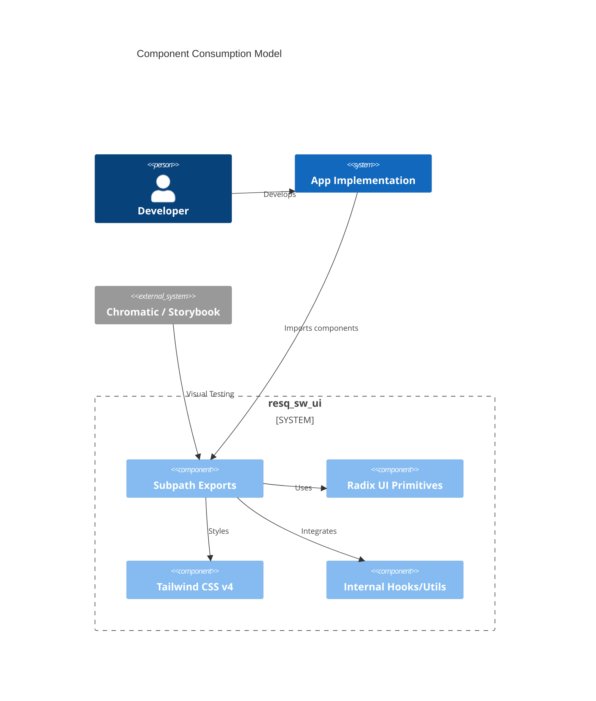

# @resq-sw/ui

A production-ready, high-performance React component library built with Radix UI primitives, Tailwind CSS v4, and strict TypeScript safety.

[](https://www.npmjs.com/package/@resq-sw/ui)
[](./LICENSE.md)
[](https://github.com/resq-software/ui/actions)

## Overview

`@resq-sw/ui` is a centralized, high-performance UI library designed for ResQ-ecosystem front-end applications. By leveraging **Radix UI** primitives and **Tailwind CSS v4** styling, we provide a robust, accessible foundation for enterprise-grade interfaces.

This project is a **shadcn-based design system**, refined for high-density, performance-critical environments.

## Features

- **Dark-First Design:** Dark theme by default, light mode as explicit opt-in via `.light` class.
- **oklch Color System:** Perceptually uniform colors for vibrant, consistent theming across dark and light modes.
- **Tree-Shakeable:** Modular architecture with per-component subpath exports for minimal bundle sizes.
- **Strictly Typed:** Full TypeScript support with explicit `.d.ts` definitions and strict null checks.
- **Accessibility First:** Built on Radix UI primitives to ensure WCAG 2.1 AA compliance.
- **Performance-Tested:** Verified frame timing, layout stability, DOM budgets, and GPU-friendly transitions.
- **Developer-Focused:** Includes custom scaffolding scripts, AI-assisted development agents, and a reproducible Nix-based environment.
- **Modern Stack:** Built on React 19, Tailwind CSS v4, and Bun.

## Architecture



### Component Conventions

- **Variant Management:** Uses `class-variance-authority` (`cva`) for all component states.
- **Composition:** Uses `Slot.Root` from Radix UI for the `asChild` pattern.
- **Styling Hooks:** Root elements include `data-slot="<component-name>"` for easy CSS targeting.
- **Merging:** Utility `cn()` (clsx + tailwind-merge) for clean className overriding.
- **Immutability:** Components are defined as plain `function` declarations for better debugging and consistent behavior.

## Installation

```bash
bun add @resq-sw/ui
# Required peer dependencies
bun add react@^19 react-dom@^19 tailwindcss@^4
```

## Quick Start

1. **Global Setup**: Include global styles in your root entry file (e.g., `main.tsx` or `layout.tsx`):
    ```tsx
    import "@resq-sw/ui/styles/globals.css";
    ```

2. **Basic Usage**:
    ```tsx
    import { Button } from "@resq-sw/ui/button";
    import { Card } from "@resq-sw/ui/card";

    export const App = () => (
      <Card>
        <Button onClick={() => alert("Ready!")}>Click Me</Button>
      </Card>
    );
    ```

## Theming & Style Guide

### Color System (oklch)

All design tokens use the `oklch` color space for perceptually uniform lightness and predictable chroma control.

#### Dark Default Tokens

| Token              | oklch                                  | Role                    |
| :----------------- | :------------------------------------- | :---------------------- |
| `background`       | `oklch(16.04% 0.0152 272.20)`         | Page background         |
| `surface`          | `oklch(19.72% 0.0231 268.80)`         | Elevated surface        |
| `card`             | `oklch(22.90% 0.0302 269.75)`         | Card background         |
| `border`           | `oklch(26.45% 0.0386 270.81)`         | Default borders         |
| `foreground`       | `oklch(96.19% 0.0109 274.89)`         | Primary text            |
| `primary`          | `oklch(58.50% 0.1877 24.72)`          | ResQ Red                |

#### Light Mode Opt-In

Add the `.light` class to a parent element to enable the light theme:

```tsx
<div className="light">
  {/* All children render in light mode */}
</div>
```

### Typography

| Font | Role | CSS class |
| :--- | :--- | :--- |
| **Syne** | Display headings, card titles, stat values | `font-display` |
| **DM Sans** | Body copy, UI text, descriptions | `font-sans` |
| **DM Mono** | Labels, buttons, badges, data, code | `font-mono` |

## API Reference

Components are exposed via subpath exports for optimal tree-shaking.

| Category | Components |
| :--- | :--- |
| **Inputs** | `Button`, `Input`, `Select`, `Checkbox`, `Combobox`, `Toggle`, `ToggleGroup`, `RadioGroup`, `Slider`, `Switch`, `InputOTP`, `NativeSelect` |
| **Layout** | `Card`, `Accordion`, `Separator`, `Resizable`, `ScrollArea`, `Sidebar`, `AspectRatio`, `Breadcrumb` |
| **Feedback** | `Alert`, `Spinner`, `Progress`, `Skeleton`, `Sonner`, `Badge`, `Kbd`, `Empty` |
| **Overlay** | `Dialog`, `Drawer`, `Popover`, `Tooltip`, `ContextMenu`, `DropdownMenu`, `HoverCard`, `AlertDialog`, `Sheet`, `Menubar` |
| **Data** | `Table`, `Calendar`, `Carousel`, `Chart`, `Pagination`, `Avatar` |
| **Utils** | `cn`, `useIsMobile`, `Direction` |

## Development

We use **Nix** and **Bun** for a reproducible, high-speed development workflow.

```bash
git clone https://github.com/resq-software/ui.git
cd ui
nix develop
```

### Common Commands

- `bun storybook`: Start development environment (port 6006)
- `bun test`: Run Vitest test suite
- `bun lint`: Run Biome checks (linting & formatting)
- `bun lint:spelling`: Run cspell spell checker
- `bun lint:knip`: Detect unused files and exports
- `bun tsc`: Run TypeScript type-checks
- `bun build`: Build project for production (emits to `lib/`)

### Testing Strategy

- **Unit/Component Testing:** Vitest with JSDOM.
- **Visual Regression:** Chromatic integration with Storybook.
- **Quality Guards:** `console-fail-test` ensures no unhandled logs or errors in tests.
- **Performance:** Performance panel integrated into Storybook for monitoring frame rates.

## Contributing

1. **Commit Convention**: We follow [Conventional Commits](https://www.conventionalcommits.org/).
2. **Quality Standards**: All code must pass linting, type-checking, and tests before submission.
3. **Branching**: Branch from `main` and submit a Pull Request.

See [CONTRIBUTING.md](.github/CONTRIBUTING.md) and [DEVELOPMENT.md](.github/DEVELOPMENT.md) for full details.

## License

This project is licensed under the Apache-2.0 License. See [LICENSE.md](./LICENSE.md) for details.

Copyright © 2026 ResQ Software
