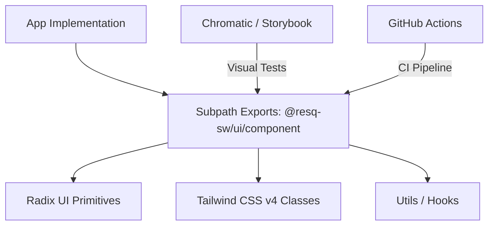

# @resq-sw/ui Documentation

A comprehensive, production-ready React component library for the ResQ platform, built on modern web standards with strict type safety and performance at its core.

---

## Table of Contents

1. [Overview](#overview)
2. [Features](#features)
3. [Architecture](#architecture)
4. [Quick Start](#quick-start)
5. [Usage](#usage)
6. [Configuration](#configuration)
7. [API Overview](#api-overview)
8. [Development](#development)
9. [Contributing](#contributing)
10. [Roadmap](#roadmap)
11. [License](#license)

---

## Overview

`@resq-sw/ui` is a centralized, high-performance UI library designed for ResQ-ecosystem front-end applications. By leveraging **shadcn/ui** primitives and **Radix UI** under the hood, we ensure accessibility and composability while maintaining strict **Tailwind CSS v4** styling.

---

## Features

- **Tree-Shakeable:** Modular architecture allows importing only the components you need.
- **Strictly Typed:** Full TypeScript support with explicit `.d.ts` definitions.
- **React 19 Ready:** Optimized for the latest concurrent React features.
- **Consistent Styling:** Unified design tokens via Tailwind CSS.
- **Production-Ready:** Rigorous testing, Chromatic visual regression, and automated CI/CD.
- **Developer Experience:** Includes custom scaffolding scripts and AI-assisted development tools.

---

## Architecture

The library is designed for modularity, using a clean subpath-export structure to ensure minimal bundle sizes.



---

## Quick Start

### 1. Installation

```bash
bun add @resq-sw/ui
# Peer dependencies
bun add react@^19 react-dom@^19 tailwindcss@^4
```

### 2. Global Setup

Include the global styles in your root layout/entry file:

```tsx
import "@resq-sw/ui/styles/globals.css";
```

### 3. Usage Example

```tsx
import { Button } from "@resq-sw/ui/button";
import { Card } from "@resq-sw/ui/card";

export const App = () => (
  <Card>
    <Button onClick={() => alert("Ready!")}>Click Me</Button>
  </Card>
);
```

---

## Usage

### Using the `cn` Utility
Our library exports a standard tailwind-merge and clsx wrapper to handle conditional class name conflicts:

```tsx
import { cn } from "@resq-sw/ui/lib/utils";

const MyComponent = ({ className, active }) => (
  <div className={cn("base-styles", active && "bg-blue-500", className)} />
);
```

### Mobile Hooks
Leverage our internal hooks for responsive logic:

```tsx
import { useIsMobile } from "@resq-sw/ui/hooks/use-mobile";

const Sidebar = () => {
  const isMobile = useIsMobile();
  return isMobile ? <MobileNav /> : <DesktopNav />;
};
```

---

## Configuration

### Tailwind Integration
Ensure your `tailwind.config.ts` incorporates the plugin or base styles provided in the package if customizing the theme.

### TypeScript
This project uses `tsconfig.json` with strict mode enabled. When consuming in your project, ensure `moduleResolution` is set to `bundler` or `node16` to correctly resolve subpath exports.

---

## API Overview

The library features 50+ components, categorized into common interface groups:

| Category | Key Components |
| :--- | :--- |
| **Input** | `Button`, `Input`, `Select`, `Checkbox`, `RadioGroup`, `Textarea` |
| **Layout** | `Card`, `Accordion`, `Sidebar`, `Separator`, `Resizable` |
| **Feedback** | `Alert`, `Spinner`, `Progress`, `Skeleton`, `Sonner` |
| **Overlay** | `Dialog`, `Drawer`, `Popover`, `Tooltip`, `ContextMenu` |

*Consult the individual `src/components/[name]/index.ts` files for specific prop interfaces.*

---

## Development

### Environment Setup
We utilize [Nix](https://nixos.org/) for development environment parity.

```bash
git clone https://github.com/resq-software/ui.git
cd ui
nix develop
```

### Workflow Scripts
- `bun storybook`: Runs Storybook for component preview.
- `bun test`: Executes Vitest suites.
- `bun lint`: Runs Biome for code consistency.
- `bun tsc`: Validates type safety across the library.

---

## Contributing

We strictly follow Conventional Commits. Please refer to `.github/CONTRIBUTING.md` for the full guidelines.

1. **Branching**: Use `feat/`, `fix/`, `docs/`, or `chore/` prefixes.
2. **Issue Templates**: Use the provided YAML templates for bugs and feature requests.
3. **Commit Hooks**: Husky is configured to run linting and tests automatically before pushes.

---

## Roadmap

- [ ] **Phase 1**: Complete migration of legacy components.
- [ ] **Phase 2**: Enhance charting library integration (d3/recharts).
- [ ] **Phase 3**: Support for custom theme generation utility.
- [ ] **Phase 4**: Expanded support for RTL languages (Direction API).

---

## License

This project is licensed under the Apache-2.0 License. See the [LICENSE.md](./LICENSE.md) file for details.
