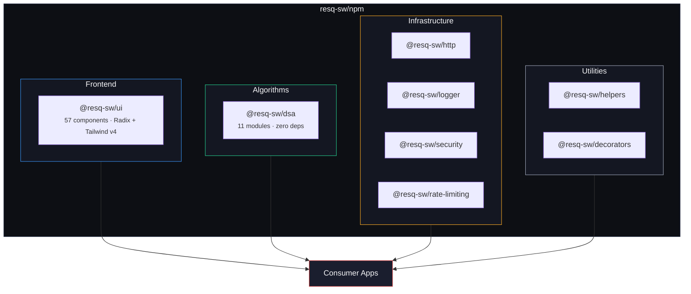

# ResQ npm Packages

[](https://github.com/resq-software/npm/actions)
[](https://master--69b2711843dac80a70e4ca83.chromatic.com)
[](LICENSE)

[](https://www.npmjs.com/package/@resq-sw/ui)
[](https://www.npmjs.com/package/@resq-sw/dsa)
[](https://www.npmjs.com/package/@resq-sw/helpers)
[](https://www.npmjs.com/package/@resq-sw/http)
[](https://www.npmjs.com/package/@resq-sw/logger)
[](https://www.npmjs.com/package/@resq-sw/decorators)
[](https://www.npmjs.com/package/@resq-sw/security)
[](https://www.npmjs.com/package/@resq-sw/rate-limiting)

Registry workspace for all ResQ npm packages published under the `@resq-sw` scope. Provides the shared UI component library, zero-dependency data structures, and standalone server/client utilities for the ResQ autonomous disaster response platform.

## Architecture



## Packages

| Package | Description | Deps | Docs |
| :--- | :--- | :--- | :--- |
| [`@resq-sw/ui`](packages/ui/) | React component library — dark-first oklch color system, WCAG AA, subpath exports | radix-ui, tailwindcss | [README](packages/ui/README.md) · [Storybook](https://master--69b2711843dac80a70e4ca83.chromatic.com) |
| [`@resq-sw/dsa`](packages/dsa/) | Data structures & algorithms — graph, heap, trie, bloom filter, distance, LRU cache, queue | **zero deps** | [README](packages/dsa/README.md) |
| [`@resq-sw/http`](packages/http/) | Effect-based HTTP client with retry, timeout, and schema validation | effect | [README](packages/http/README.md) |
| [`@resq-sw/logger`](packages/logger/) | Structured logging with 7 levels, context, timing, and logging decorators | **zero deps** | [README](packages/logger/README.md) |
| [`@resq-sw/security`](packages/security/) | AES-256-GCM encryption, threat detection, PII sanitization, input validation | effect (peer) | [README](packages/security/README.md) |
| [`@resq-sw/rate-limiting`](packages/rate-limiting/) | Throttle, debounce, token bucket, leaky bucket, sliding window, Redis store | effect (peer) | [README](packages/rate-limiting/README.md) |
| [`@resq-sw/decorators`](packages/decorators/) | 15 TypeScript decorators — memoize, throttle, debounce, bind, execTime, rateLimit | **zero deps** | [README](packages/decorators/README.md) |
| [`@resq-sw/helpers`](packages/helpers/) | Result monad, type guards, date/number/string formatting, platform detection | @resq-sw/logger | [README](packages/helpers/README.md) |

## Examples

Working examples showing the packages in action:

| Example | What it demonstrates | Run |
| :--- | :--- | :--- |
| [`react-dashboard`](examples/react-dashboard/) | Mission Control UI using all packages — cards, tables, badges, distance calculations, priority queues, throttled actions, sanitized logs | `bun --filter example-react-dashboard dev` |
| [`node-api`](examples/node-api/) | Bun.serve() HTTP server with structured logging, rate limiting, PII sanitization, request tracking | `bun --filter example-node-api dev` |
| [`dsa-pathfinding`](examples/dsa-pathfinding/) | Earthquake drone response — Graph pathfinding, PriorityQueue triage, BloomFilter survey tracking, Trie dispatch lookup | `bun --filter example-dsa-pathfinding start` |

## Design Assets

Brand assets live in [`design/`](design/) — logos, icons, PWA assets, and the engineering style guide.

| Asset | Variants | Formats |
| :--- | :--- | :--- |
| [Drone coordination mark](design/assets/icons/) | `resq-mark-color`, `resq-mark-mono-black`, `resq-mark-mono-white` | svg, png, webp |
| [Logo lockups](design/assets/logos/) | horizontal, stacked, tagline, mono (dark + light) | svg, png, webp |
| [Gradient mark](design/assets/logos/) | `resq-mark-gradient` — full-bleed mark on dark | svg, png, webp |
| [OG banner](design/assets/logos/) | Social sharing card | svg, png, webp |
| [PWA icons](design/assets/pwa/) | Android, iOS, Windows 11 | png, webp |
| [Style guide](design/STYLE_GUIDE.md) | oklch color tokens, typography, spacing, component rules | — |
| [Logo system](design/resq-logo-system.pdf) | Lockup specs, icon sizing, usage guidelines | pdf |

## Development

### Prerequisites

- [Bun](https://bun.sh/) >= 1.x
- Node.js >= 20.19.0

### Setup

```bash
git clone https://github.com/resq-software/npm.git
cd npm
bun install
```

### Commands

```bash
bun install                          # Install all workspace dependencies
bun test                             # Run all workspace tests
bun run build                        # Build all packages
bun --filter @resq-sw/<pkg> test     # Test single package
bun --filter @resq-sw/<pkg> build    # Build single package
bun --filter @resq-sw/ui storybook   # Start Storybook dev server
bun --filter @resq-sw/ui lint        # Lint with Biome
bun changeset                        # Create a changeset for versioning
```

### Stack

| Layer | Tool |
| :--- | :--- |
| Runtime | Bun 1.x |
| Language | TypeScript (strict) |
| Build | tsdown |
| Testing | Vitest |
| Linting | Biome |
| Versioning | Changesets |
| Visual testing | Chromatic (UI) |

## Contributing

1. Branch from `master` and make changes in the relevant `packages/` directory.
2. Run `bun test` to verify nothing breaks.
3. Run `bun changeset` to describe your changes for the changelog.
4. Submit a Pull Request.

Commits follow [Conventional Commits](https://www.conventionalcommits.org/) (`feat:`, `fix:`, `chore:`, `perf:`, `refactor:`). See [CONTRIBUTING.md](.github/CONTRIBUTING.md) and [DEVELOPMENT.md](.github/DEVELOPMENT.md) for full details.

## License

Apache-2.0 — see [LICENSE.md](./LICENSE.md).

Copyright 2026 ResQ Software
