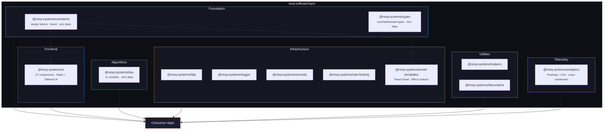

<!--
  Copyright 2026 ResQ Systems, Inc.

  Licensed under the Apache License, Version 2.0 (the "License");
  you may not use this file except in compliance with the License.
  You may obtain a copy of the License at

      http://www.apache.org/licenses/LICENSE-2.0

  Unless required by applicable law or agreed to in writing, software
  distributed under the License is distributed on an "AS IS" BASIS,
  WITHOUT WARRANTIES OR CONDITIONS OF ANY KIND, either express or implied.
  See the License for the specific language governing permissions and
  limitations under the License.
-->

# ResQ Systems npm Packages

[](https://github.com/resq-software/npm/actions)
[](https://master--69b2711843dac80a70e4ca83.chromatic.com)
[](LICENSE)

[](https://www.npmjs.com/package/@resq-systems/ui)
[](https://www.npmjs.com/package/@resq-systems/dsa)
[](https://www.npmjs.com/package/@resq-systems/helpers)
[](https://www.npmjs.com/package/@resq-systems/http)
[](https://www.npmjs.com/package/@resq-systems/logger)
[](https://www.npmjs.com/package/@resq-systems/decorators)
[](https://www.npmjs.com/package/@resq-systems/security)
[](https://www.npmjs.com/package/@resq-systems/rate-limiting)
[](https://www.npmjs.com/package/@resq-systems/analytics)
[](https://www.npmjs.com/package/@resq-systems/constants)
[](https://www.npmjs.com/package/@resq-systems/types)
[](https://www.npmjs.com/package/@resq-systems/email-templates)

Registry workspace for all ResQ Systems npm packages published under the `@resq-systems` scope. Provides the shared UI component library, zero-dependency data structures, and standalone server/client utilities for the ResQ Systems autonomous disaster response platform.

## Architecture


```mermaid
graph TB
    subgraph repo["resq-software/npm"]
        direction TB
        subgraph foundation["Foundation"]
            constants["@resq-systems/constants<br/><small>design tokens · brand · zero deps</small>"]
            types["@resq-systems/types<br/><small>nominal/branded types · zero deps</small>"]
        end
        subgraph frontend["Frontend"]
            ui["@resq-systems/ui<br/><small>57 components · Radix + Tailwind v4</small>"]
        end
        subgraph algorithms["Algorithms"]
            dsa["@resq-systems/dsa<br/><small>11 modules · zero deps</small>"]
        end
        subgraph infra["Infrastructure"]
            http["@resq-systems/http"]
            logger["@resq-systems/logger"]
            security["@resq-systems/security"]
            ratelimit["@resq-systems/rate-limiting"]
            email["@resq-systems/email-templates<br/><small>React Email · Effect contract</small>"]
        end
        subgraph utilities["Utilities"]
            helpers["@resq-systems/helpers"]
            decorators["@resq-systems/decorators"]
        end
        subgraph telemetry["Telemetry"]
            analytics["@resq-systems/analytics<br/><small>PostHog + GA4 · cross-subdomain</small>"]
        end
    end

    constants --> ui
    constants --> email
    foundation --> apps["Consumer Apps"]
    frontend --> apps
    algorithms --> apps
    infra --> apps
    utilities --> apps
    telemetry --> apps

    style repo fill:#0d0f14,stroke:#222b42,color:#f5f5f7
    style foundation fill:#141722,stroke:#5db8ff,color:#f5f5f7
    style frontend fill:#141722,stroke:#388feb,color:#f5f5f7
    style algorithms fill:#141722,stroke:#25c68a,color:#f5f5f7
    style infra fill:#141722,stroke:#f5a623,color:#f5f5f7
    style utilities fill:#141722,stroke:#9ba3b5,color:#f5f5f7
    style telemetry fill:#141722,stroke:#b478ff,color:#f5f5f7
    style apps fill:#1a1e2e,stroke:#e24b4a,color:#f5f5f7
```

## Packages

| Package | Description | Deps | Docs |
| :--- | :--- | :--- | :--- |
| [`@resq-systems/constants`](packages/constants/) | Shared design tokens (oklch + email-safe hex), brand identity, and cross-app values — one source of truth | **zero deps** | [README](packages/constants/README.md) |
| [`@resq-systems/types`](packages/types/) | Nominal/branded type toolkit — `Brand`, `Opaque`, `NumberRange`, numeric brands, `assertNever`, and type-level test helpers | **zero deps** | [README](packages/types/README.md) |
| [`@resq-systems/ui`](packages/ui/) | React component library — dark-first oklch color system, WCAG AA, subpath exports | radix-ui, tailwindcss | [README](packages/ui/README.md) · [Storybook](https://master--69b2711843dac80a70e4ca83.chromatic.com) |
| [`@resq-systems/dsa`](packages/dsa/) | Data structures & algorithms — graph, heap, trie, bloom filter, distance, LRU cache, queue | **zero deps** | [README](packages/dsa/README.md) |
| [`@resq-systems/http`](packages/http/) | Effect-based HTTP client with retry, timeout, and schema validation | effect | [README](packages/http/README.md) |
| [`@resq-systems/logger`](packages/logger/) | Structured logging with 7 levels, context, timing, and logging decorators | **zero deps** | [README](packages/logger/README.md) |
| [`@resq-systems/security`](packages/security/) | AES-256-GCM encryption, threat detection, PII sanitization, input validation | effect (peer) | [README](packages/security/README.md) |
| [`@resq-systems/rate-limiting`](packages/rate-limiting/) | Throttle, debounce, token bucket, leaky bucket, sliding window, Redis store | effect (peer) | [README](packages/rate-limiting/README.md) |
| [`@resq-systems/decorators`](packages/decorators/) | 15 TypeScript decorators — memoize, throttle, debounce, bind, execTime, rateLimit | **zero deps** | [README](packages/decorators/README.md) |
| [`@resq-systems/helpers`](packages/helpers/) | Result monad, type guards, date/number/string formatting, platform detection | @resq-systems/logger | [README](packages/helpers/README.md) |
| [`@resq-systems/analytics`](packages/analytics/) | Unified PostHog + GA4 client — cross-subdomain identity, lazy-loaded, typed events, Next.js + React adapters | posthog-js (peer) | [README](packages/analytics/README.md) |
| [`@resq-systems/email-templates`](packages/email-templates/) | Type-safe transactional emails — Effect Schema contract, React Email components, headless render, optional Resend sender | react, effect, @react-email | [README](packages/email-templates/README.md) |

## Examples

Working examples showing the packages in action:

| Example | What it demonstrates | Run |
| :--- | :--- | :--- |
| [`react-dashboard`](examples/react-dashboard/) | Mission Control UI using all packages — cards, tables, badges, distance calculations, priority queues, throttled actions, sanitized logs | `bun --filter example-react-dashboard dev` |
| [`node-api`](examples/node-api/) | Bun.serve() HTTP server with structured logging, rate limiting, PII sanitization, request tracking | `bun --filter example-node-api dev` |
| [`dsa-pathfinding`](examples/dsa-pathfinding/) | Earthquake drone response — Graph pathfinding, PriorityQueue triage, BloomFilter survey tracking, Trie dispatch lookup | `bun --filter example-dsa-pathfinding start` |

## Design Assets

Brand assets live in [`design/`](design/) — logos, icons, PWA assets, and the engineering style guide.

| Asset | Variants | Formats |
| :--- | :--- | :--- |
| [Drone coordination mark](design/assets/icons/) | `resq-mark-color`, `resq-mark-mono-black`, `resq-mark-mono-white` | svg, png, webp |
| [Logo lockups](design/assets/logos/) | horizontal, stacked, tagline, mono (dark + light) | svg, png, webp |
| [Gradient mark](design/assets/logos/) | `resq-mark-gradient` — full-bleed mark on dark | svg, png, webp |
| [OG banner](design/assets/logos/) | Social sharing card | svg, png, webp |
| [PWA icons](design/assets/pwa/) | Android, iOS, Windows 11 | png, webp |
| [Style guide](design/STYLE_GUIDE.md) | oklch color tokens, typography, spacing, component rules | — |
| [Logo system](design/resq-logo-system.pdf) | Lockup specs, icon sizing, usage guidelines | pdf |

## Development

### Prerequisites

- [Bun](https://bun.sh/) >= 1.x
- Node.js >= 20.19.0

### Setup

```bash
git clone https://github.com/resq-software/npm.git
cd npm
bun install
```

### Commands

```bash
bun install                          # Install all workspace dependencies
bun test                             # Run all workspace tests
bun run build                        # Build all packages
bun --filter @resq-systems/<pkg> test     # Test single package
bun --filter @resq-systems/<pkg> build    # Build single package
bun --filter @resq-systems/ui storybook   # Start Storybook dev server
bun --filter @resq-systems/ui lint        # Lint with Biome
bun changeset                        # Create a changeset for versioning
```

### Stack

| Layer | Tool |
| :--- | :--- |
| Runtime | Bun 1.x |
| Language | TypeScript (strict) |
| Build | tsdown |
| Testing | Vitest |
| Linting | Biome |
| Versioning | Changesets |
| Visual testing | Chromatic (UI) |

## Contributing

1. Branch from `master` and make changes in the relevant `packages/` directory.
2. Run `bun test` to verify nothing breaks.
3. Run `bun changeset` to describe your changes for the changelog.
4. Submit a Pull Request.

Commits follow [Conventional Commits](https://www.conventionalcommits.org/) (`feat:`, `fix:`, `chore:`, `perf:`, `refactor:`). See [CONTRIBUTING.md](.github/CONTRIBUTING.md) and [DEVELOPMENT.md](.github/DEVELOPMENT.md) for full details.

## License

Apache-2.0 — see [LICENSE.md](./LICENSE.md).

Copyright 2026 ResQ Systems, Inc.
